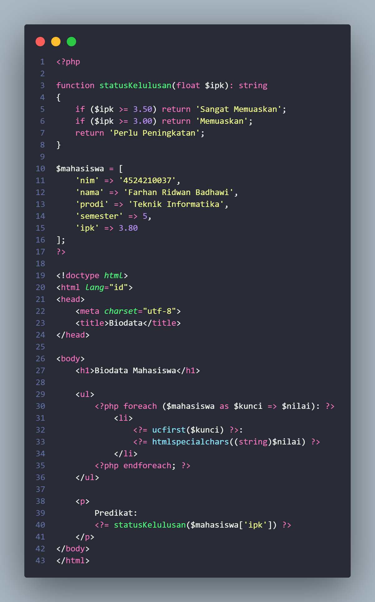
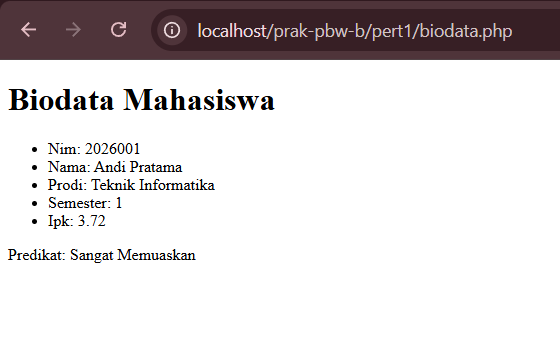
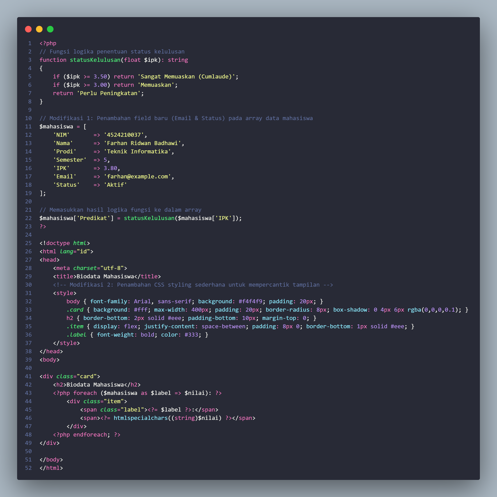
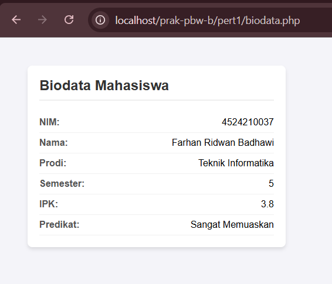

# Laporan Praktikum Pertemuan 1

**Nama**: Farhan Ridwan Badhawi  
**NIM**: 4524210037  
**Kelas**: PBW-B  

---

## 1. Tangkapan Layar (Screenshot)

### Sebelum Modifikasi

### Sesudah Modifikasi

---

## 2. Penjelasan Perubahan
* Mengubah tampilan data dari daftar list HTML (`<ul>`) biasa menjadi komponen *card* yang rapi.
* Menyatukan panggilan fungsi `statusKelulusan()` langsung ke dalam array asosiatif `$mahasiswa`.
* Menambahkan variabel kunci berhuruf kapital agar langsung tampil rapi tanpa fungsi `ucfirst()`.