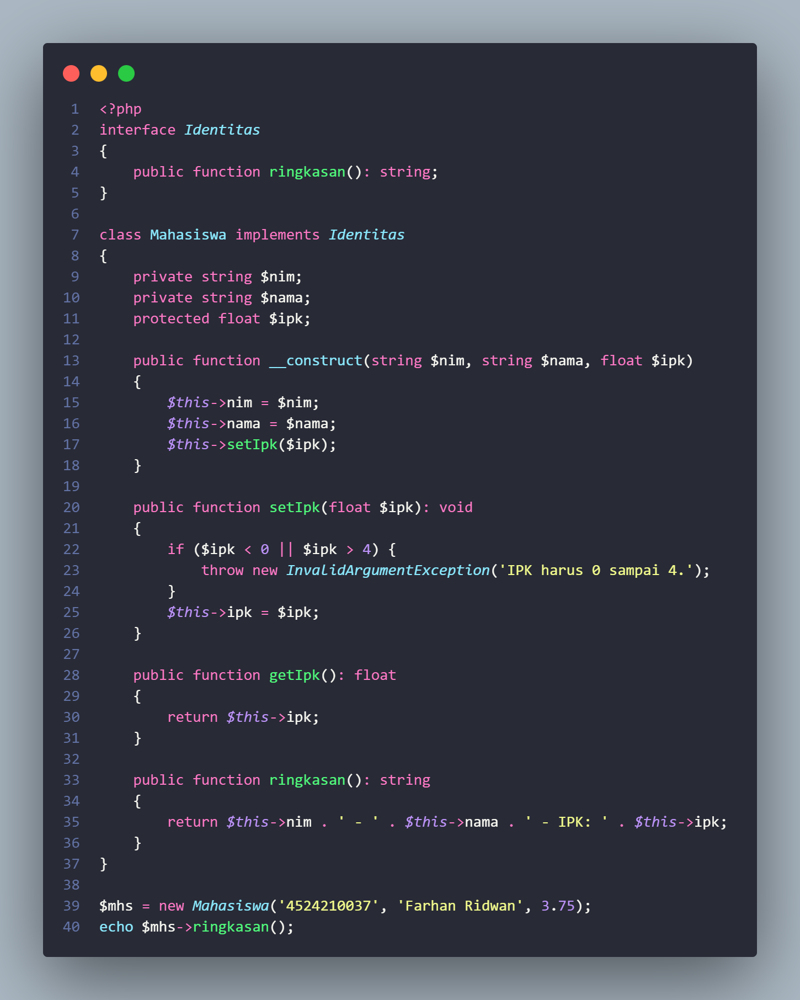
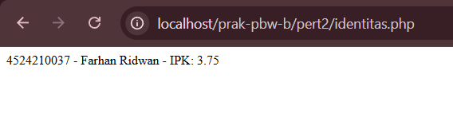
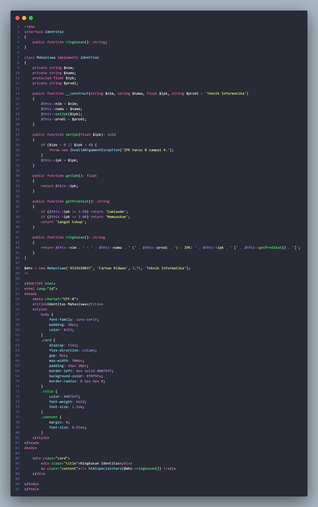
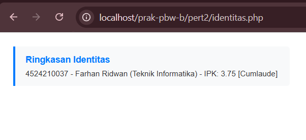

# Laporan Praktikum Pertemuan 2

**Nama**: Farhan Ridwan Badhawi  
**NIM**: 4524210037  
**Kelas**: PBW-B  

---

## 1. Tangkapan Layar (Screenshot)

### Sebelum Modifikasi

### Sesudah Modifikasi

---

## 2. Penjelasan Perubahan
* Mengimplementasikan konsep OOP (*Class*, *Interface*, dan *Encapsulation*).
* Menambahkan atribut `$prodi` dan method `getPredikat()` untuk menentukan predikat akademik otomatis.
* Mengatur tata letak tampilan ringkasan menggunakan CSS Flexbox.