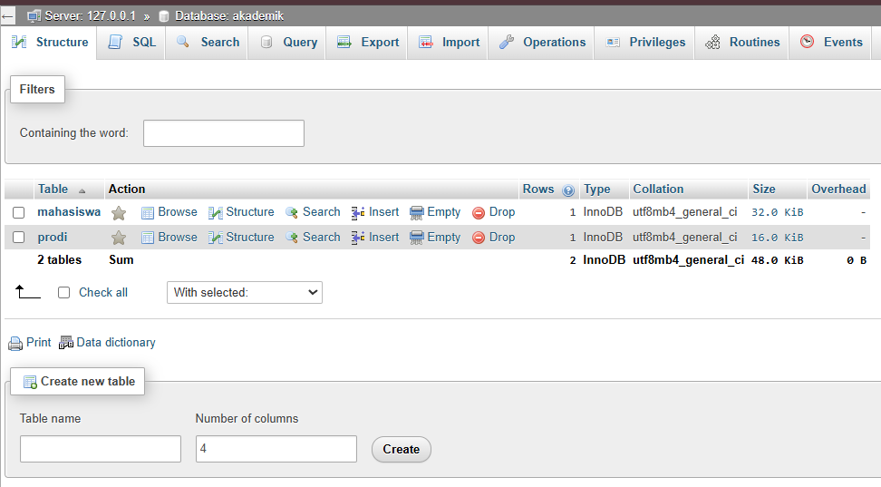
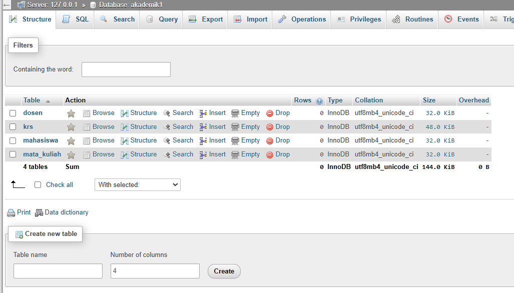
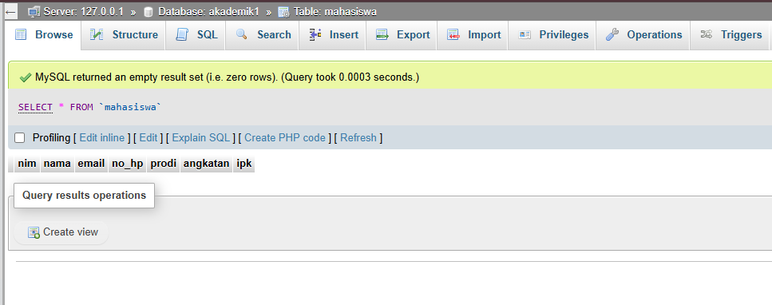
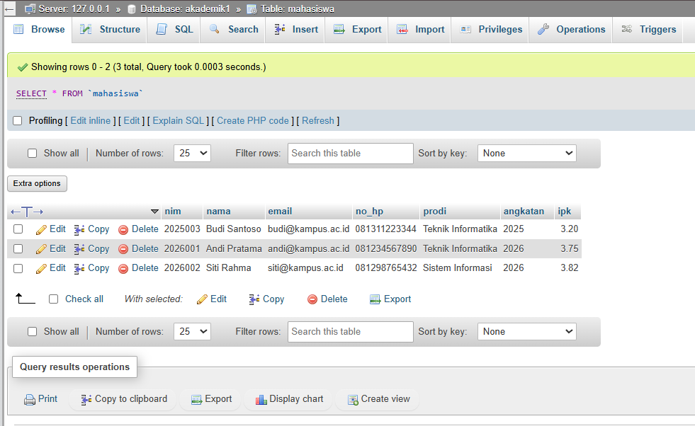
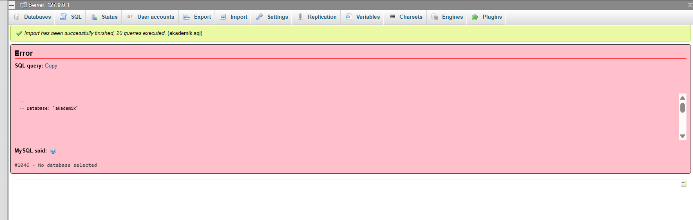

# Laporan Praktikum - Pertemuan 3: Desain & Manipulasi Database

**Informasi Mahasiswa:**
* **Nama:** Farhan Ridwan Badhawi
* **NIM:** 4524210037
* **Matkul:** Prak PBW 

---

## 1. Contoh Pertemuan 3
### A. Contoh akademik

### B. Contoh akademik1


Seluruh skrip SQL Pertemuan 3 telah berhasil dijalankan tanpa error kritis[cite: 4].

### Screenshot Sebelum Modifikasi

> *Keterangan: Menampilkan database `akademik1` yang memuat 4 tabel utama (`dosen`, `krs`, `mahasiswa`, `mata_kuliah`)

---

## 2. Modifikasi Program

Dua modifikasi bermakna yang ditambahkan pada pangkalan data sesuai materi DDL dan DML[cite: 4, 13, 20]:

* **Modifikasi 1: Penambahan Kolom `no_hp` pada Tabel `mahasiswa` (DDL)**[cite: 2, 4, 13]
  * **Penjelasan:** Menambahkan kolom `no_hp` bertipe `VARCHAR(15)` pada tabel `mahasiswa` untuk melengkapi informasi kontak mahasiswa.
  * **Kueri SQL:**
    ```sql
    ALTER TABLE mahasiswa 
    ADD COLUMN no_hp VARCHAR(15) AFTER email;
    ```

* **Modifikasi 2: Pengisian Data Sampel Mahasiswa (DML)**
  * **Penjelasan:** Memasukkan baris data baru ke dalam tabel `mahasiswa` menggunakan perintah `INSERT INTO` untuk menguji penyimpanan data.
  * **Kueri SQL:**
    ```sql
    INSERT INTO mahasiswa (nim, nama, email, prodi, angkatan, ipk, no_hp) VALUES
    ('2026001', 'Andi Pratama', 'andi@kampus.ac.id', 'Teknik Informatika', 2026, 3.75, '081234567890'),
    ('2026002', 'Siti Rahma', 'siti@kampus.ac.id', 'Sistem Informasi', 2026, 3.82, '081298765432'),
    ('2025003', 'Budi Santoso', 'budi@kampus.ac.id', 'Teknik Informatika', 2025, 3.20, '081311223344');
    ```

### Screenshot Sesudah Modifikasi


> *Keterangan: Menampilkan kondisi tabel `mahasiswa` setelah penambahan kolom `no_hp` dan pengisian data sampel.*

---

## 3. Penjelasan Bagian Kode Penting

Berikut adalah 5 bagian kode SQL paling penting beserta penjelasannya

1. **`CREATE DATABASE IF NOT EXISTS akademik1;`**
   * **Fungsi:** Membuat database baru bernama `akademik1` jika database tersebut belum tersedia di server.
2. **`PRIMARY KEY`**
   * **Fungsi:** Menjadikan kolom sebagai identitas unik utama agar tidak ada data ganda
3. **`FOREIGN KEY ... REFERENCES`**
   * **Fungsi:** Menghubungkan relasi antar tabel (misalnya kolom `nim` di tabel `krs` merujuk ke `nim` di tabel `mahasiswa`)
4. **`ON UPDATE CASCADE ON DELETE CASCADE`**
   * **Fungsi:** Memastikan perubahan atau penghapusan data induk otomatis memperbarui data terkait di tabel turunan
5. **`CONSTRAINT uq_krs UNIQUE (nim, kode_mk, semester, tahun_ajaran)`**
   * **Fungsi:** Membatasi agar kombinasi mahasiswa, mata kuliah, semester, dan tahun ajaran tidak bisa terduplikasi

---

## 4. Analisis Error & Langkah Perbaikan


Langkah penanganan error yang sempat ditemui saat proses pengerjaan:

* **Pesan Error:** `#1046 - No database selected`[cite: 1]
* **Penyebab:** Melakukan impor berkas SQL tanpa memilih atau membuat database tujuan terlebih dahulu di phpMyAdmin
* **Solusi Perbaikan:**
  1. Membuat database baru terlebih dahulu (misal: `akademik1`)[cite: 1, 6].
  2. Mengklik nama database tersebut pada menu sebelah kiri hingga aktif[cite: 1].
  3. Mengulang kembali proses impor berkas SQL