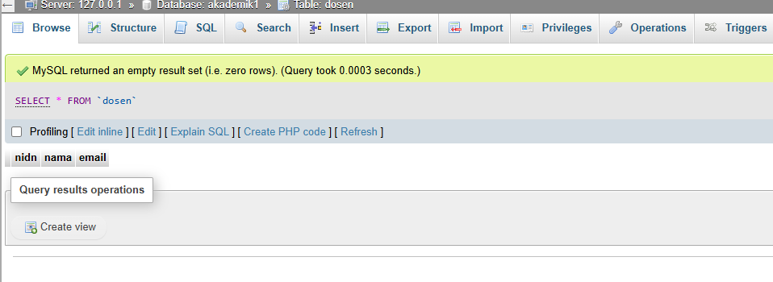
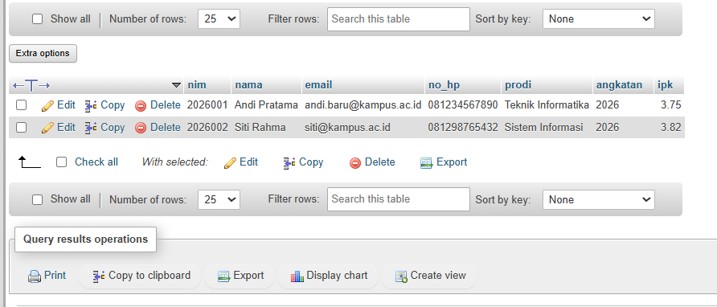

# Laporan Praktikum - Pertemuan 3: Desain & Manipulasi Database

**Informasi Mahasiswa:**
* **Nama:** Farhan Ridwan Badhawi
* **NIM:** 4524210037
* **Matkul:** Prak PBW 

---

## 1. Contoh Pertemuan 3


Seluruh skrip SQL Pertemuan 3 telah berhasil dijalankan tanpa error kritis[cite: 4].

### Screenshot Sebelum Modifikasi
### A .

### B .
> *Keterangan: Menampilkan database `akademik1` yang memuat 4 tabel utama (`dosen`, `krs`, `mahasiswa`, `mata_kuliah`)

---

## 2. Modifikasi Program

Dua modifikasi struktur tabel (DDL) yang ditambahkan pada pangkalan data[cite: 13, 25]:

* **Modifikasi 1: Penambahan Kolom `tanggal_lahir` pada Tabel `mahasiswa` (DDL)**[cite: 11, 13]
  * **Penjelasan:** Menambahkan kolom `tanggal_lahir` bertipe data `DATE` setelah kolom `nama` pada tabel `mahasiswa` untuk melengkapi profil mahasiswa[cite: 11, 13].
  * **Kueri SQL:**
    ```sql
    ALTER TABLE mahasiswa 
    ADD COLUMN tanggal_lahir DATE AFTER nama;
    ```

* **Modifikasi 2: Penambahan Kolom `no_telepon` pada Tabel `dosen`**[cite: 11, 13]
  * **Penjelasan:** Menambahkan kolom `no_telepon` bertipe data `VARCHAR(15)` pada tabel `dosen` untuk menyimpan kontak pengajar[cite: 11, 13].
  * **Kueri SQL:**
    ```sql
    ALTER TABLE dosen 
    ADD COLUMN no_telepon VARCHAR(15);
    ```

### Screenshot Sesudah Modifikasi
### A .

### B .
> *Keterangan: Menampilkan struktur tabel `mahasiswa` dan `dosen` di phpMyAdmin setelah penambahan kolom baru melalui perintah ALTER TABLE[cite: 13].*

---

## 3. Penjelasan Bagian Kode Penting

Berikut adalah 5 bagian kueri SQL paling penting pada Pertemuan 3 beserta penjelasannya

1. **`CREATE DATABASE IF NOT EXISTS akademik1;`**
   * **Fungsi:** Membuat pangkalan data baru bernama `akademik1` secara otomatis apabila pangkalan data tersebut belum terdaftar
2. **`PRIMARY KEY`**
   * **Fungsi:** Menentukan kolom sebagai identitas unik utama pada tabel agar tidak terjadi duplikasi data
3. **`FOREIGN KEY ... REFERENCES`**
   * **Fungsi:** Membentuk hubungan (relasi) antar tabel, seperti menghubungkan kolom `nim` pada tabel `krs` ke `nim` di tabel `mahasiswa`
4. **`ON UPDATE CASCADE ON DELETE CASCADE`**
   * **Fungsi:** Memastikan apabila data utama diubah atau dihapus, perubahan tersebut otomatis diterapkan pada data terkait di tabel turunan
5. **`CONSTRAINT uq_krs UNIQUE (nim, kode_mk, semester, tahun_ajaran)`**
   * **Fungsi:** Membatasi kombinasi data pengambilan KRS agar tidak terjadi pengambilan mata kuliah yang sama oleh mahasiswa di semester dan tahun ajaran yang sama

---

## 4. Analisis Error & Langkah Perbaikan


Langkah penanganan error yang sempat ditemui saat proses pengerjaan:

* **Pesan Error:** `#1046 - No database selected`
* **Penyebab:** Melakukan impor berkas SQL tanpa memilih atau membuat database tujuan terlebih dahulu di phpMyAdmin
* **Solusi Perbaikan:**
  1. Membuat database baru terlebih dahulu (misal: `akademik1`)
  2. Mengklik nama database tersebut pada menu sebelah kiri hingga aktif
  3. Mengulang kembali proses impor berkas SQL