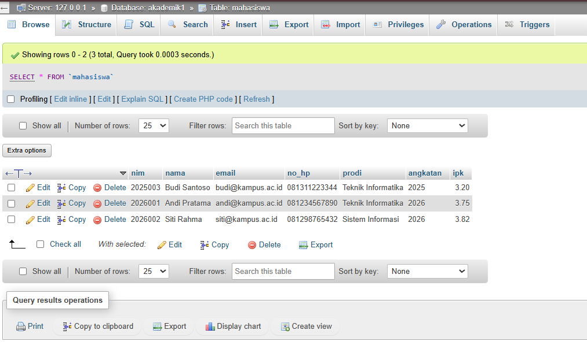
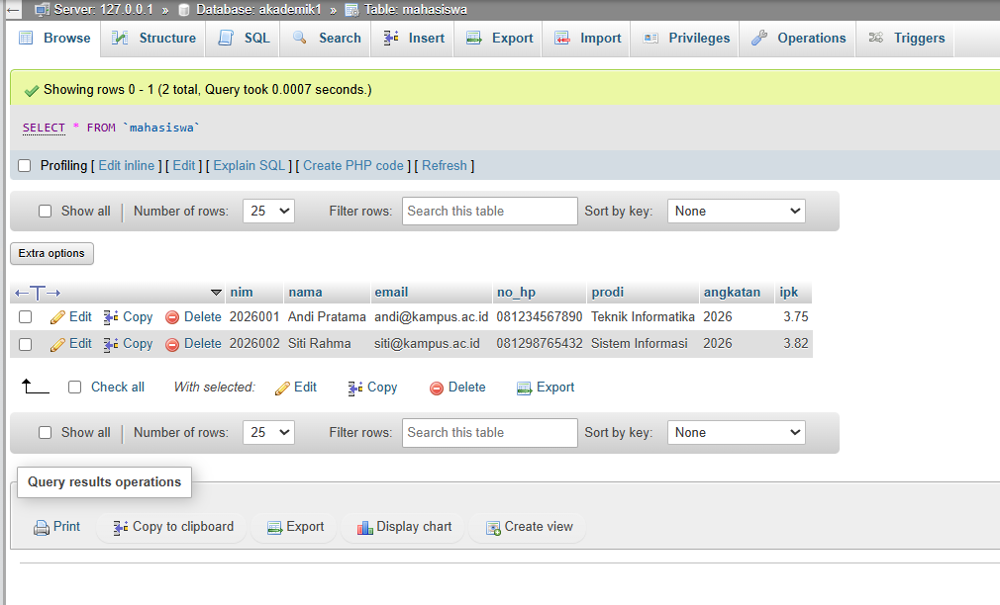
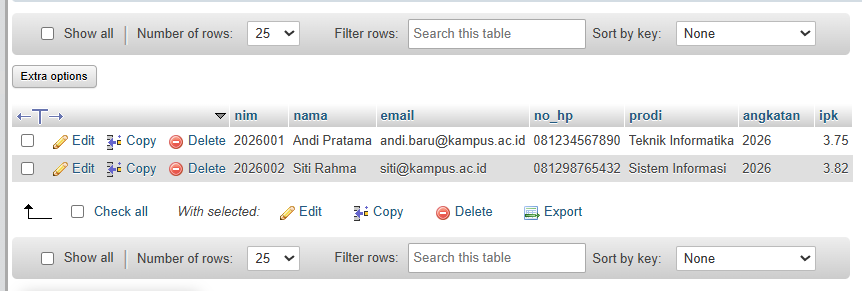
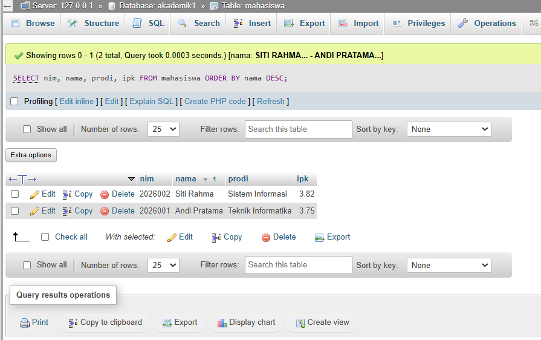
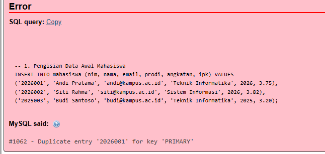

# Laporan Praktikum - Pertemuan 4: SQL Query & Manipulasi Data (DML)

**Informasi Mahasiswa:**
* **Nama:** Farhan Ridwan Badhawi
* **NIM:** 4524210037
* **Matkul:** PBW

---

## 1. Contoh Pertemuan 4

### Latihan A


### Latihan B

Seluruh kueri DML (Data Manipulation Language) Pertemuan 4 pada pangkalan data `akademik1` telah berhasil dijalankan tanpa error.


### Screenshot Sebelum Modifikasi

> *Keterangan: Menampilkan data pada tabel `mahasiswa` setelah eksekusi kueri INSERT, UPDATE, dan DELETE dari Latihan Kode Program A dan B*.

---

## 2. Modifikasi Program

Dua modifikasi bermakna yang ditambahkan pada kueri Pertemuan 4.

* **Modifikasi 1: Pembaruan Email Mahasiswa (DML UPDATE)**.
  * **Penjelasan:** Mengubah data alamat email milik mahasiswa dengan NIM '2026001' (Andi Pratama) menggunakan perintah `UPDATE` dan klausa `WHERE`.
  * **Kueri SQL:**
    ```sql
    UPDATE mahasiswa 
    SET email = 'andi.baru@kampus.ac.id' 
    WHERE nim = '2026001';
    ```

* **Modifikasi 2: Menampilkan Seluruh Mahasiswa Terurut Nama (DML SELECT & ORDER BY)**[cite: 19, 20, 23, 25]
  * **Penjelasan:** Menampilkan data NIM, Nama, Prodi, dan IPK mahasiswa dengan urutan nama secara alfabetis (A-Z) menggunakan `ORDER BY nama ASC`[cite: 20, 23].
  * **Kueri SQL:**
    ```sql
    SELECT nim, nama, prodi, ipk 
    FROM mahasiswa 
    ORDER BY nama DESC;
    ```

### Screenshot Sesudah Modifikasi
### A. 

### B. 

> *Keterangan: Menampilkan hasil pembaharuan email serta keluaran kueri SELECT terurut setelah modifikasi dijalankan[cite: 18, 20, 25].*

---

## 3. Penjelasan Bagian Kode Penting

Berikut adalah 5 bagian kueri SQL paling penting pada Pertemuan 4 beserta penjelasannya[cite: 25]:

1. **`INSERT INTO mahasiswa (...) VALUES (...)`**
   * **Fungsi:** Memasukkan baris data mahasiswa baru ke dalam tabel `mahasiswa`[cite: 16, 23].
2. **`WHERE ipk >= 3.50`**
   * **Fungsi:** Memfilter baris data agar hanya menampilkan data mahasiswa dengan nilai IPK 3.50 atau lebih[cite: 19, 23].
3. **`UPDATE mahasiswa SET ipk = 3.40 WHERE nim = '2025003'`**
   * **Fungsi:** Memperbarui nilai IPK mahasiswa tertentu secara spesifik berdasarkan parameter NIM[cite: 18, 24].
4. **`GROUP BY prodi`**
   * **Fungsi:** Mengelompokkan baris data berdasarkan nama program studi untuk menghitung agregasi seperti jumlah dan rata-rata IPK[cite: 21, 24].
5. **`DELETE FROM mahasiswa WHERE nim = '2025003'`**
   * **Fungsi:** Menghapus baris data mahasiswa tertentu dari tabel berdasarkan kriteria NIM[cite: 18, 24].

---

## 4. Analisis Error & Langkah Perbaikan

Detail penanganan error yang sempat ditemui saat pengerjaan.

* **Pesan Error:** `#1062 - Duplicate entry '2026001' for key 'PRIMARY'`.
* **Penyebab:** Mencoba memasukkan baris data baru dengan nilai NIM `2026001` yang sudah ada sebelumnya di tabel, sehingga melanggar aturan `PRIMARY KEY`
* **Solusi Perbaikan:**.
  1. Menghapus atau mengosongkan isi tabel terlebih dahulu dengan `TRUNCATE TABLE mahasiswa;` jika ingin mengulang pengisian.
  2. Atau langsung melanjutkan ke kueri `SELECT`/`UPDATE` tanpa mengeksekusi ulang baris `INSERT` yang duplikat.